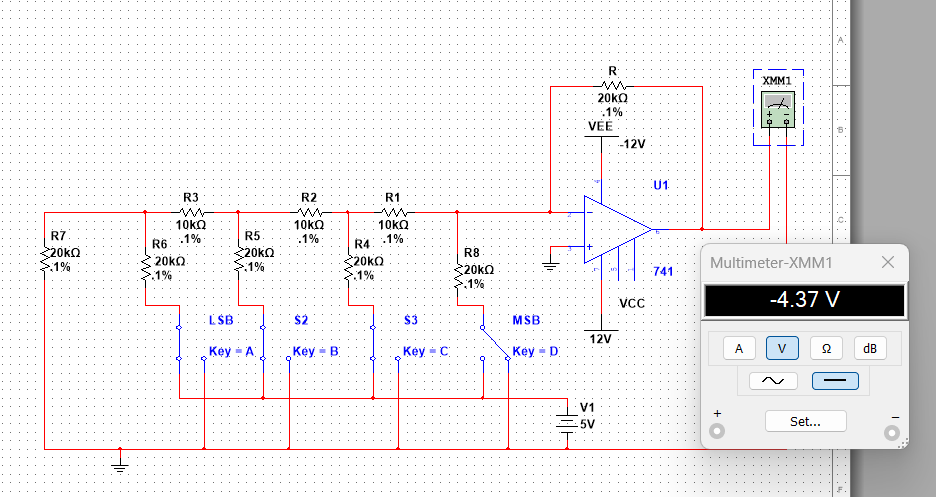

# R-2R-ladder-DAC

## Abstract
In this project, a Digital-to-Analog Converter using R-2R Ladder Network is implemented. The Digital-to-Analog Converter is used for converting digital signals into analog voltage using resistors and an op-amp.

## Table of Contents
- Introduction
- Components Used
- Circuit Design
- Working Principle
- Results
- Conclusion

## Introduction
In digital logic, binary numbers (0 and 1) are used. However, real-life signals cannot be represented as binary numbers. The Digital-to-Analog Converter is used for converting digital signals into analog voltage.

## Components Used
- Resistors (R and 2R)
- Op-Amp (741)
- DC Supply
- Switches for Digital Inputs
- Multimeter for measuring output voltage

## Circuit Design

Figure: R-2R ladder DAC circuit

## Working Principle
- A combination of resistors in R-2R format is utilized.
- Digital input in the form of 0 and 1 is provided by switches.
- Each bit of input contributes to the voltage.
- The op-amp sums up the outputs.
- The final output is an analog voltage proportional to the input.
  
## Results
- Different input voltages produce different outputs.
- Analog voltage varies in proportion to the input.
- Verified by a multimeter in simulation mode.

## Conclusion
The project demonstrates the conversion of digital signals into analog signals by utilizing the R-2R resistor network and op-amp.
  
## Future Scope
- Increase the number of bits in the system
- Implementation of the system by utilizing a microcontroller
- Implementation in audio signals
