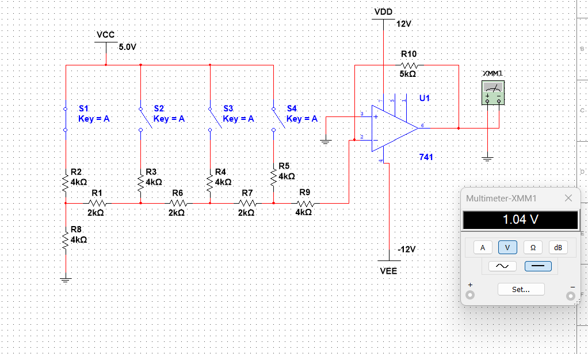

# R-2R-ladder-DAC

## Abstract
This project demonstrates a Digital-to-Analog Converter using an R-2R ladder network. It converts digital input signals into corresponding analog voltage output using resistors and an op-amp.

## Table of Contents
- Introduction
- Components Used
- Circuit Design
- Working Principle
- Results
- Conclusion

## Introduction
Digital systems work with binary values (0 and 1), but real-world signals are analog. A DAC is used to convert digital signals into analog signals. This project uses an R-2R ladder network for conversion.

## Components Used
- Resistors (R and 2R values)
- Op-Amp (741)
- DC Supply
- Switches (for digital input)
- Multimeter (for output measurement)

## Circuit Design

Figure: R-2R ladder DAC circuit

## Working Principle
- The circuit uses a combination of resistors arranged in R-2R form.
- Digital inputs (0 or 1) are given using switches.
- Each bit contributes to the output voltage.
- The op-amp sums and amplifies the output.
- Final output is an analog voltage proportional to the digital input.
  
## Results
- Different digital inputs produce different analog voltages.
- Output voltage changes proportionally with binary input.
- Verified using multimeter in simulation.

## Conclusion
This project shows how digital signals can be converted into analog using an R-2R resistor network and an op-amp. It helps in understanding basic DAC operation.

## Future Scope
- Increase number of bits for better accuracy
- Implementation using microcontroller
- Use in audio signal applications
